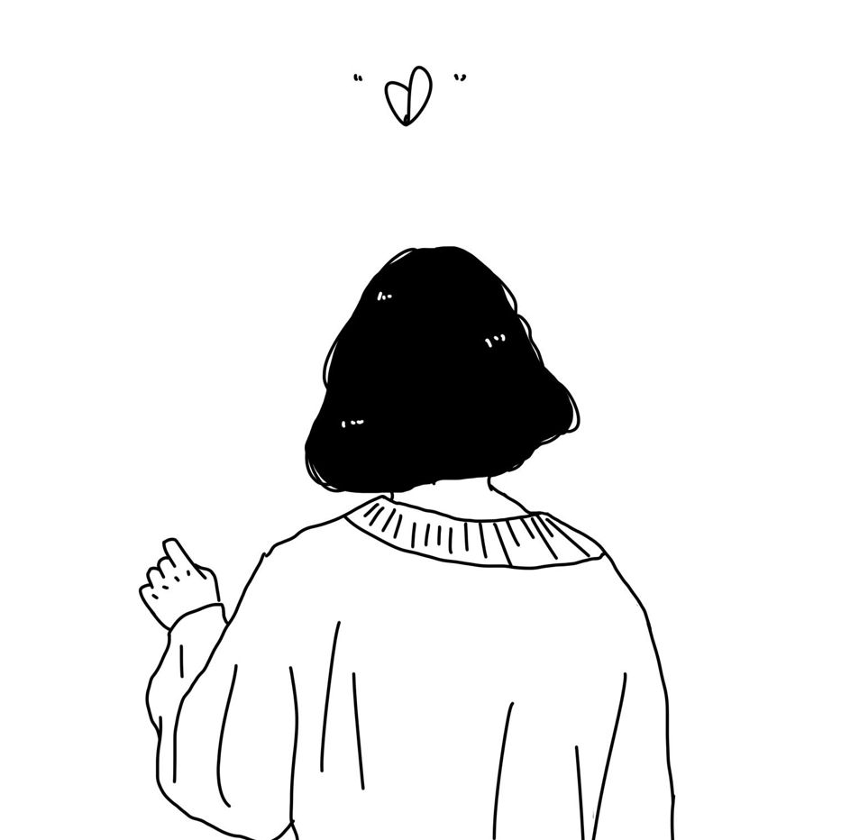

## img2pixel

图片像素化+图片文字化 小工具

#### 打包
````
git clone https://github.com/hunterwyld/img2pixel.git
mvn clean assembly:assembly 
````

#### 图片像素化
````
java -jar target/img2pixel-1.0-jar-with-dependencies.jar screenshot/girl1.jpeg 5 0
````
##### 原图(screenshot/girl1.jpeg)

##### 输出(output.jpg)


#### 图片文字化
````
java -jar target/img2pixel-1.0-jar-with-dependencies.jar screenshot/girl2.jpg 20 1 && cat output.txt
````
##### 原图(screenshot/girl2.jpg)

##### 输出(output.txt)
````
                                                                                              
                                                                                              
                                                                                              
                                            , <                                               
                                      ! , < 1 _   <                                           
                                          _ + _                                               
                                          l r >                                               
                                                                                              
                                                                                              
                                                                                              
                                                                                              
                                                                                              
                                                                                              
                                            > ] 1 ]                                           
                                          j W $ $ $ 0 :                                       
                                        t $ $ $ $ $ $ w :                                     
                                      ; 8 # $ $ $ $ $ $ (                                     
                                      c $ $ $ $ $ $ $ $ h l                                   
                                    - @ $ $ $ $ $ $ $ # $ t                                   
                                    0 $ $ $ $ $ $ $ $ % $ o ,                                 
                                  I * $ $ $ $ $ $ $ $ $ $ $ j                                 
                                  , 8 $ $ $ $ $ $ $ $ $ $ $ $ /                               
                                  < $ $ $ $ $ $ $ $ $ $ $ $ $ * :                             
                                  L $ # @ $ $ $ $ $ $ $ $ $ $ b i                             
                                : B $ $ $ $ $ $ $ $ $ $ $ % v I                               
                                I @ $ $ $ $ $ $ $ $ $ $ B [                                   
                                  U @ $ $ $ $ & m C c c !                                     
                                    ] 1 z C (         _ +                                     
                                    ~ { ( ] + _ _ _ + + } x { :                               
                  !           , - + : i ] - ? - - ] + _ _ 1 | ( _                             
                  ) <       > _           ~ [ ] ~ < ~ ! <   - I - 1                           
                ) < ? }   , _                   > + + + ] + _ + < l ~                         
              ! _ >   ! ! _ ,                                       ~ ;                       
              I -   l _ - _                                           -                       
                < ] i   { ,         !                                 > ;                     
                  _ : : +           +                                   +                     
                l > < _   ,         +                                   +                     
                -   - > l !     +   + >                             >   +                     
                +   -   +       +   + +                             +   < :                   
                ? > ;   +       + , ~ +                 _           +   l !                   
                ) +     +       + i I +               : <         , ~   I i                   
                + +     +       + +   < ,             ~ ,     ; ; ~ ,   ; >                   
                + +     +       + <   I i             +       , < +       ~                   
                ~ !     +       +       >             +         + +       +                   
                  ? :   ~       +                     +         + +       _                   
                    + _ ,     , ?                     +         _ ~       +                   
                        { } , } _                     ~         1 ;       +                   
````